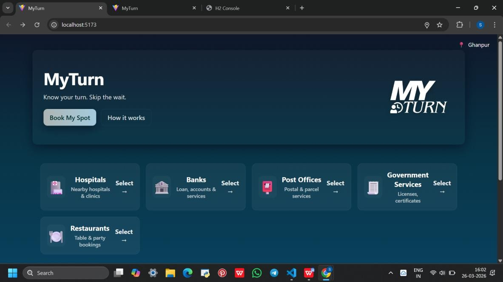
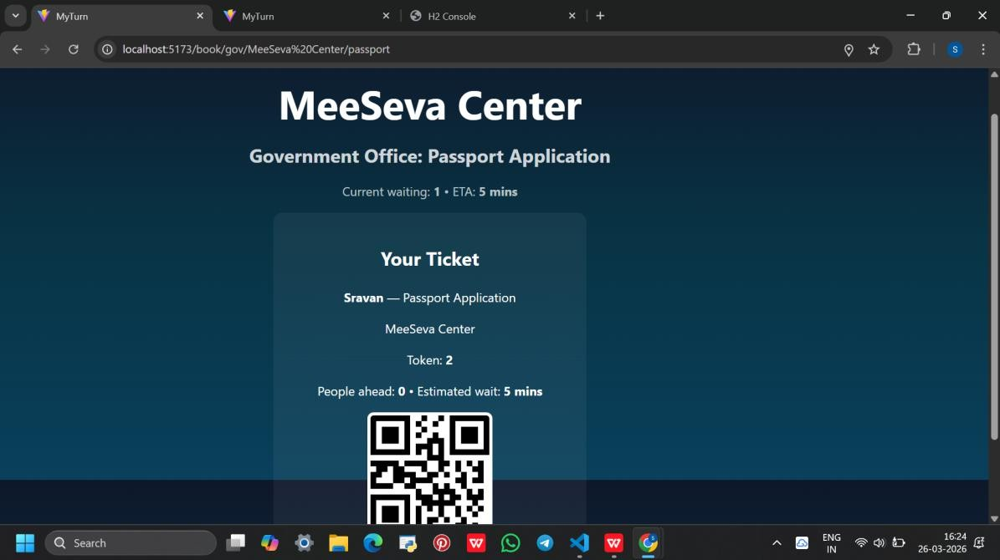
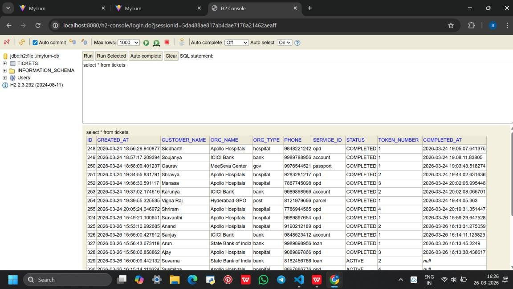
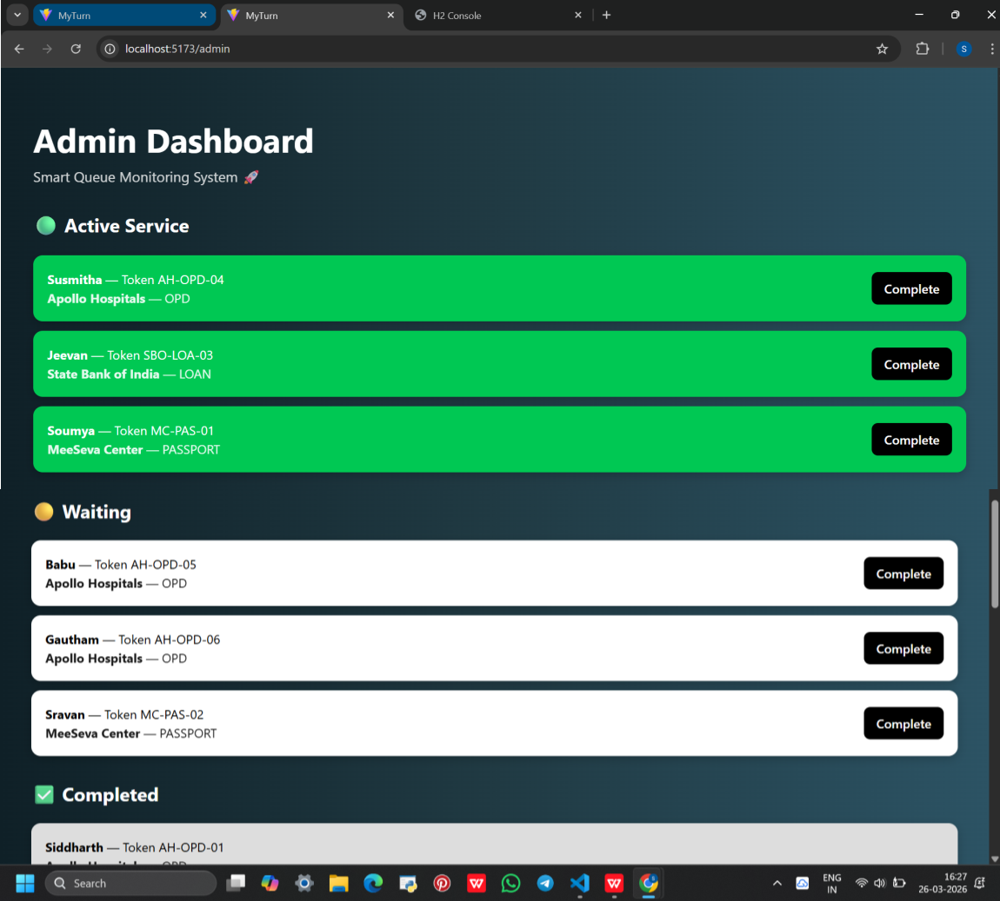

# 🎫 MyTurn — Smart Queue Management System

> *Know your turn. Skip the wait.*


---

## 📌 About the Project

**MyTurn** is an intelligent, full-stack Smart Queue Management System designed to eliminate the inefficiencies of traditional queue systems. It provides real-time queue tracking, automated ticket management, and machine learning-based Estimated Time of Arrival (ETA) prediction — all through a clean, user-friendly web interface.

---

## ✨ Features

- 🏥 **Multi-Domain Support** — Hospitals, Banks, Post Offices, Government Services
- 🎟️ **Digital Ticket Generation** — With unique QR code for contactless verification
- 📊 **Real-Time Queue Tracking** — Live waiting count and queue status updates
- 🤖 **ML-Based ETA Prediction** — Decision Tree Regression model predicts waiting time dynamically
- 🖥️ **Admin Dashboard** — Centralized control to monitor and manage all queues
- ⚡ **Automated Queue Progression** — Auto-transitions tickets from WAITING → ACTIVE → COMPLETED
- 📱 **Responsive UI** — Clean, card-based interface built with React.js

---

## 🛠️ Tech Stack

| Layer | Technology |
|-------|-----------|
| Frontend | React.js, Vite |
| Backend | Spring Boot (Java) |
| Database | H2 (In-memory Relational DB) |
| Machine Learning | Python, scikit-learn (Decision Tree Regressor) |
| API | RESTful APIs (JSON) |
| ML Serialization | joblib |

---

## 📁 Folder Structure

```
PROJECT_MyTurn/
├── MyTurn-frontend/       # React.js frontend application
│   ├── src/
│   │   ├── components/    # Reusable UI components
│   │   ├── pages/         # Page-level components
│   │   └── App.jsx
│   ├── public/
│   └── package.json
│
├── MyTurn-backend/        # Spring Boot backend application
│   ├── src/
│   │   └── main/
│   │       ├── java/      # Java source files
│   │       └── resources/ # Application config
│   └── pom.xml
│
└── MyTurn-ml/             # Python ML model
    ├── train_model.py     # Model training script
    └── queue_data.csv     # Training data (generated at runtime)
```

---

## 🚀 How to Run Locally

### Prerequisites
- Node.js (v16+)
- Java JDK 17+
- Python 3.8+
- Maven

---

### 1️⃣ Run the Backend (Spring Boot)

```bash
cd MyTurn-backend
mvn spring-boot:run
```
Backend runs on: `http://localhost:8080`

---

### 2️⃣ Run the Frontend (React)

```bash
cd MyTurn-frontend
npm install
npm run dev
```
Frontend runs on: `http://localhost:5173`

---

### 3️⃣ Train the ML Model (Python)

```bash
cd MyTurn-ml
pip install pandas scikit-learn joblib
python train_model.py
```

---

## 🔗 API Endpoints

| Endpoint | Method | Description |
|----------|--------|-------------|
| `/checkin` | POST | Book a new ticket |
| `/stats` | GET | Get real-time queue stats and ETA |
| `/admin/active` | GET | Get currently active tickets |
| `/admin/waiting` | GET | Get all waiting tickets |
| `/admin/completed` | GET | Get all completed tickets |
| `/admin/complete/{id}` | PUT | Mark ticket as completed |

---

## 🤖 Machine Learning Model

The system uses a **Decision Tree Regression** model to predict waiting times.

**Features used for prediction:**
- Organization Type
- Organization Name
- Service Type
- Current Waiting Count
- Time of Day (Hour)

**Formula:**
```
ETA = (Waiting Count - 1) × Predicted Average Service Time
```

The model is trained on historical completed ticket data and improves in accuracy as more data is collected over time.

---

## 🖼️ Screenshots

### Home Page


### Ticket Generation


### H2 Data Console


### Admin Dashboard


---

## 🔮 Future Enhancements

- 📲 Real-time SMS / Push Notifications
- ☁️ Cloud Deployment (AWS / Azure / GCP)
- 🔄 Automated ML Model Retraining Pipeline
- 🔐 User Authentication & Role-based Access
- 📈 Advanced Analytics Dashboard
- ⚡ Priority Queue Support (Senior Citizens, Emergency)

---

## 📄 License

This project was developed for academic purposes as part of B.Tech Capstone Project at KL University, April 2026.

---

<p align="center">Made with ❤️ by Team MyTurn | KL University 2026</p>
